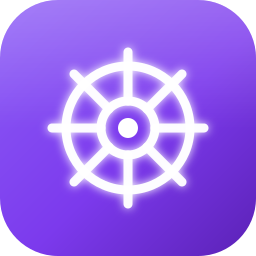

<div align="center">



# Sailor

**一个面板管理你所有的 Kubernetes 集群**


[核心设计](#核心设计) · [功能](#功能清单) · [构建运行](#构建运行) · [项目结构](#项目结构) · [已知限制](#已知限制)

资源查看走本地缓存（毫秒级），写操作直连 API Server，<br>
原生桌面窗口，容器终端 WebSocket 直通、零轮询延迟。

<sub>单用户桌面应用 —— Go + Wails v2</sub>

</div>

---

## 它解决什么问题

管理多套 K8s 集群时，几个绕不开的麻烦：

**1. `kubectl config use-context` 来回切，还容易切错**
手上握着好几份 kubeconfig，每次查东西先切上下文，切错了就在错误的集群上执行了操作。
Sailor 把集群导入后统一在一个面板里切换，当前集群始终显示在顶栏。

**2. 大集群 `kubectl get pods -A` 慢得没法用**
本项目的测试集群有 250+ 节点、16000+ Pod，一次全量拉 Pod 列表要 **4 分钟**、响应体 **168MB**，
传输中途经常被网络截断。Sailor 用后台 goroutine 按周期把资源同步进本地缓存，页面读缓存：

| 资源 | 条数 | 直连 API Server | 读本地缓存 |
|---|---:|---:|---:|
| Pod | 16765 | 259.6 s | **毫秒级** |
| Deployment | 154 | 4.30 s | **< 1 ms** |
| Service | 283 | 0.47 s | **< 1 ms** |

> 写操作（扩缩容 / 重启 / 删除 / 回滚）一律直连 API Server，不读缓存，避免拿旧状态做决策。

**3. 排查问题要在终端和面板之间来回跳**
看日志、进容器、改 YAML 各是一套命令。Sailor 把这些收进界面：
Pod 日志直接看，容器终端在窗口里开，YAML 在线编辑且提交前走 K8s 真实 dry-run 校验。

---

## 核心设计

### 桌面端架构（Go + Wails）

```
┌──────────────────────────────────────────────────┐
│  原生窗口 (WKWebView / WebView2)                  │
│  HTML + Alpine.js + DaisyUI + ECharts + Monaco    │
│      │ fetch（同源）                               │
│      │ WebSocket（容器终端 / kubectl 终端，直连本地网关）│
├──────────────────────────────────────────────────┤
│  Wails AssetServer Middleware → Go http.ServeMux  │
│  ├── 页面路由（Go html/template 渲染）             │
│  ├── JSON API（/resources/... /clusters/...）      │
│  └── /static/*（内嵌前端资源）                      │
├──────────────────────────────────────────────────┤
│  业务层                                            │
│  ├── syncer   后台同步（60s 周期 + 立即同步）        │
│  ├── resops   资源操作（scale/rollback/dry-run）    │
│  ├── execsess 终端会话（remotecommand 桥接）        │
│  ├── ksh      内置 kubectl 终端（进程内命令树）      │
│  ├── metrics  指标聚合（Metrics Server 降级链）      │
│  └── store    本地持久化（文件存储 + AES-GCM 加密）  │
├──────────────────────────────────────────────────┤
│  client-go（dynamic + typed + remotecommand）      │
│  + k8s.io/kubectl（进程内 kubectl 命令树）          │
└──────────────────────────────────────────────────┘
```

### 读缓存、写直连

后台为每个集群起一个 goroutine，每 **60 秒**按固定顺序同步 15 类资源：

```
namespace → pod → deployment → service → configmap → secret
→ ingress → persistentvolumeclaim → statefulset → daemonset
→ job → cronjob → hpa
→ keda: scaledobject / scaledjob
```

> KEDA 两类是 CRD 资源：集群未安装 KEDA 时同步器探测到 404 会落空缓存并
> 标记"未安装"—— 侧栏自动收起 KEDA 菜单（列表接口也不会误报"集群连接异常"，
> 直链访问时显示引导空态）；装上 KEDA 后下一轮同步自动恢复菜单。

- 缓存落在数据目录 `cache/c<id>/<kind>.json`，整个资源类型的列表序列化进一个
  JSON 文件，每轮**全量替换** —— 不做增量 diff，省掉一整类「删掉的资源没清理干净」的 bug。
- 同步锁是**按资源类型**的，周期同步和写操作触发的立即同步在资源粒度互斥，
  互不阻塞（改了 Deployment 不会卡住 Pod 的同步）。
- 单类资源同步失败不中断整轮，错误落盘后由前端透出
  「集群连接异常，列表数据可能不是最新的」横幅，而不是让页面假装数据是新的。

### 大集群列表用 chunked list 分页

一次性拉全量在大集群上会失败：测试集群的 Pod 列表单响应体达 **168MB**，
传输中途连接被断。改走 K8s 原生的 chunked list：每页 500 条，靠 `continue` token
往下翻，单个响应从百 MB 级降到几 MB。翻页途中 token 过期（410 Gone）会从头重来一次，
另设 5 万条上限作为保险丝。

### 三种工作负载的回滚机制并不相同

| 资源 | 历史版本来源 | 定位当前版本 |
|---|---|---|
| Deployment | ReplicaSet | `deployment.kubernetes.io/revision` annotation |
| StatefulSet | ControllerRevision | `status.update_revision`（完整 CR 名） |
| DaemonSet | ControllerRevision | 无对应字段，需从 Pod 上的 `controller-revision-hash` 取众数 |

回滚统一用 **JSON Merge Patch** 只改 `spec.template`，不整体 replace ——
这样 K8s 控制器能复用已有的 ReplicaSet，不会每次回滚都堆出一个新的。

### 容器终端：WebSocket 直通

排查问题时终端是高频动作，不能忍受 HTTP 轮询的输入延迟。Sailor 的做法：

1. 打开终端时，Go 侧通过 client-go `remotecommand`（WebSocket 优先、SPDY 回退）
   建立到容器的 exec 流，并签发一次性会话 token；
2. xterm.js 直连本地回环（127.0.0.1 随机端口）上的 WebSocket 网关；
3. 二进制帧直通键盘输入与容器输出，文本帧走 resize / exit 控制消息 —— **零轮询延迟**。

会话仍有空闲超时（5 分钟）与总数上限（32 个）兜底。

### 内置 kubectl 终端：进程内命令树

侧栏的「kubectl 终端」给活动集群开一个 REPL：不依赖系统里装没装 kubectl，
而是把 `k8s.io/kubectl` 的命令树直接链进应用，语法与真 kubectl 完全一致
（与 client-go 同为 v0.37，无版本错配）。

- kubeconfig 从加密存储物化成会话临时文件（`--kubeconfig` 指定，权限 0600，
  会话结束即删），**完全不碰 `~/.kube/config` 与 `KUBECONFIG` 环境变量**；
- Go 侧自带行编辑器（回显 / 退格 / ↑↓ 历史 / Ctrl+C / Ctrl+L），kubectl
  输出经 WS 直推 xterm.js；
- 前台命令运行期间，`exec -i` / `apply -f -`（粘贴 YAML 后 Ctrl+D 发 EOF）
  的键盘输入直通命令 stdin；
- `edit` / `diff` / `port-forward` / `proxy` / `plugin` 依赖外部进程，
  在分发前拦截并给出替代提示（`edit` 引导到 YAML 编辑弹窗）；
- 每条命令的执行包 `recover` 兜底，kubectl 库内部异常不会带崩应用。

会话空闲 15 分钟回收，上限 8 个。Ctrl+C 一律本地取消命令（不转发为远程
SIGINT），退出交互式 `exec -it` 请输入 `exit`。

### kubeconfig 加密存储

kubeconfig 用 **AES-256-GCM** 加密后落盘，密钥为数据目录下随机生成的
`key.bin`（权限 0600）。数据目录位置：

- macOS：`~/Library/Application Support/Sailor/`
- Linux：`~/.config/Sailor/`
- Windows：`%AppData%/Sailor/`

可用环境变量 `ARMADA_DATA_DIR` 覆盖。备份该目录即可完整迁移；
`key.bin` 丢失则已导入的 kubeconfig 无法解密，务必注意。

---

## 功能清单

### 多集群管理
- kubeconfig 导入 / 编辑集群，凭据加密存储
- 集群状态（在线 / 离线）后台探测刷新，展示 K8s 版本、节点数、API Server
- 顶栏一键切换当前集群（选择持久化，重启应用不丢）

### 资源管理

| 分类 | 资源 |
|---|---|
| 工作负载 | Deployment、StatefulSet、DaemonSet、Job、CronJob、Pod |
| 弹性伸缩 | HPA、KEDA ScaledObject、KEDA ScaledJob |
| 网络 | Service、Ingress |
| 配置 | ConfigMap、Secret |
| 存储 | PersistentVolumeClaim |
| 其他 | Namespace |

支持的操作：

- **查看**：列表、详情弹窗（概览 + Events + 关联 Pods）、YAML 查看
- **写入**：扩缩容（scale 子资源）、重启（打 `kubectl.kubernetes.io/restartedAt` 注解）、
  回滚到历史 revision、在线编辑 YAML、通过 YAML 模板新建、删除（含级联警告与 Pod 强制删除）
- **调度**：CronJob 挂起 / 恢复调度（`spec.suspend`）、立即触发一次
  （按 jobTemplate 生成一次性 Job，等价 `kubectl create job --from`）
- **弹性伸缩**：HPA 目标 / 指标 / 副本范围一览；KEDA ScaledObject / ScaledJob
  管理（触发器、副本范围、Ready 状态），挂起 / 恢复走 KEDA 标准的
  `autoscaling.keda.sh/paused-replicas` 注解；未安装 KEDA 的集群自动收起
  KEDA 菜单（直链访问时显示引导空态）
- **诊断**：Pod 日志（tail 行数 / 上次日志 / 3 秒自动刷新）、容器终端、
  容器层卡点 reason 高亮（`ImagePullBackOff` 等）
- **kubectl 终端**：进程内 kubectl 命令树 REPL，无需本机安装 kubectl
- **节点**：Cordon / Uncordon / Drain（policy/v1 Eviction）/ 移除

### 仪表盘
- 集群级 CPU / 内存汇总与节点明细
- 数据源降级链：Metrics Server → Pod requests 聚合，不会直接空着
- CPU / 内存 Top 10、GPU 节点统计（ECharts）

### 界面
- 亮 / 暗主题一键切换，编辑器（Monaco）与图表（ECharts）随动
- 侧栏折叠、展开状态持久化
- YAML 编辑、终端、图表在两种主题下均单独适配

---

## 构建运行

### 环境要求

- Go 1.24+
- [Wails v2 CLI](https://wails.io)：`go install github.com/wailsapp/wails/v2/cmd/wails@latest`
- Node.js 18+（仅用于编译 Tailwind CSS 与同步静态资源）
- 至少一份可用的 kubeconfig
- Windows 10+ 额外需要 WebView2 Runtime（Win11 自带）

> Wails 不支持交叉编译：macOS 包需要在 macOS 上构建，Windows 包需要在
> Windows 上构建（PowerShell 运行 `scripts/build.ps1`）。

### macOS

```bash
# 1. 构建前端静态资源（同步 static/ → frontend/dist/ 并编译 CSS）
npm install
npm run build:ui

# 2. 构建应用（若 CommandLineTools 的 SDK 报 tbd 架构错误，
#    脚本会自动改用 Xcode 自带 SDK）
./scripts/build.sh            # 或 npm run build:mac

# 3. 安装到 /Applications 并启动
./scripts/install.sh

#   或仅运行构建产物
open build/bin/Sailor.app
```

### Windows（PowerShell）

```powershell
# 1. 构建前端静态资源
npm install
npm run build:ui

# 2. 构建应用
.\scripts\build.ps1          # 或 npm run build:win
#    附加参数会透传给 wails，例如：.\scripts\build.ps1 -debug

# 3. 运行
.\build\bin\Sailor.exe
```

开发调试：

```bash
~/go/bin/wails dev        # 热加载窗口（macOS）
go test ./...             # 单元测试（含全部页面模板渲染冒烟）
go run ./cmd/preview      # 浏览器预览 UI（临时假数据，不依赖 Wails / 真实集群）
```

首次启动后从「集群管理 → 导入集群」粘贴 kubeconfig 即可。

---

## 项目结构

```
Sailor/
├── main.go                  # Wails 入口（窗口、AssetServer 装配）
├── app.go                   # 生命周期：启动时拉起同步服务
├── wails.json               # Wails 配置
├── cmd/preview/             # 独立浏览器预览服务（调 UI 用，假数据）
├── internal/
│   ├── store/               # 本地存储：集群配置 + 资源缓存 + AES-GCM 加密
│   ├── k8sx/                # client-go 客户端池（dynamic + typed）+ GVR 表
│   ├── serialize/           # K8s 对象 → 前端轻量 JSON
│   ├── syncer/              # 后台同步：chunked list 分页 + per-type 锁
│   ├── resops/              # 资源操作：apply/dry-run/scale/restart/回滚/describe
│   ├── metrics/             # Prometheus 客户端 + 集群指标聚合降级链
│   ├── execsess/            # 容器终端：exec 会话 + 本地 WS 网关
│   └── webui/               # HTTP 路由、页面渲染、handlers + 模板冒烟测试
│       └── templates/       # Go html/template 页面与组件
├── frontend/dist/           # 内嵌静态资源（构建产物，勿手改）
├── static/                  # 前端资源源文件（vendor JS / CSS 源）
├── scripts/                 # build.sh（macOS，含 SDK 兼容处理）/ build.ps1（Windows）
│                              / install.sh / sync-static.js（跨平台静态资源同步）
├── design_plan.md           # 前端设计文档（布局 / 主题 / 组件规范）
└── docs/screenshots/        # 截图与截图规范
```

---

## 已知限制

写在明面上，避免误解：

- **缓存有同步窗口**：列表数据最长可能滞后一个同步周期（60 秒）。写操作会触发
  立即同步并把 K8s 返回的最新状态直接回填到前端。
- **超大集群同步耗时可能超过同步周期**：16000+ Pod 的集群单轮 Pod 同步约 4 分钟。
- **Drain 不处理 PDB 冲突**：某个 Pod 因 PodDisruptionBudget 驱逐失败时只记日志、
  不中断流程。
- **集群状态判定是单次探测**，网络抖动可能造成一次误判为离线，下一轮刷新恢复。
- **kubeconfig 加密密钥在本机**：`key.bin` 与数据同目录，防的是备份同步等场景的
  偶然泄露，不防本机 root。如需更高强度可自行接入系统钥匙串。
- **单用户定位**：桌面应用面向单一操作者，未内置多用户与权限体系；
  生产环境请通过 kubeconfig 的 RBAC 控制实际权限边界。

---

## 许可证

私有项目，保留所有权利。完整条款见 [LICENSE](LICENSE)。
